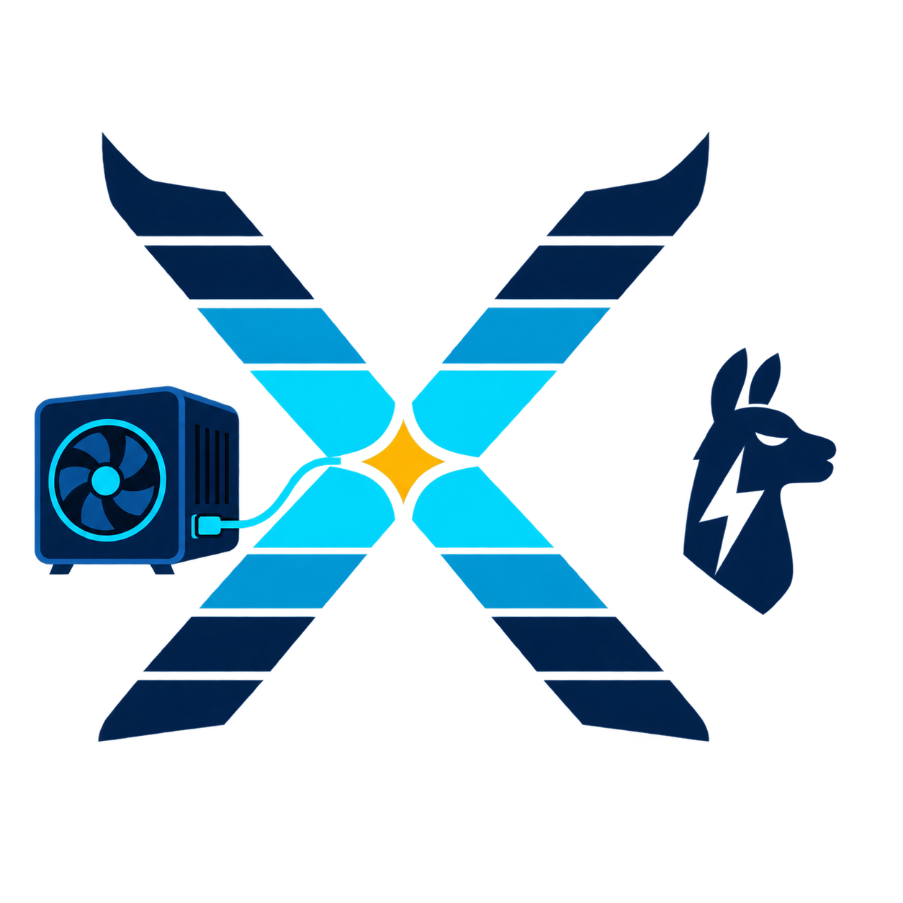

<p align="center">
  
</p>

# ThunderLlamaX

**LLM inference on an eGPU, hitched to a Mac.**
*(Or, if you prefer: the Mac that thinks it's an Ultra.)*

Run a local LLM on your Mac — any Apple Silicon Mac with Thunderbolt — by
attaching an NVIDIA RTX 3090 eGPU over Thunderbolt 4. macOS supports no eGPU
on Apple Silicon and ships no NVIDIA driver, so this project brings its own:
an open DriverKit driver that talks raw PCIe to the GPU (no CUDA runtime, no
CUDA driver, no NVIDIA userspace), a hand-written kernel engine, and an
OpenAI-compatible API on top. The result: **75.81 tokens per second** decode
at 100k-token context on Qwen3.8-27B — **bit-exact** against greedy decoding
— with 569/510/342 tok/s prefill and a durable prompt cache that restores a
100k context in ~6.5 seconds. Local inference, on a Mac, at workstation speed.

The X reads as *ten*: K=10 speculative depth is the signature number
(75.81 tok/s, bit-exact, see below).

The cast, if you like flavor names: the **DraftHorse** engine (the hand-kernel
engine and its draft-and-verify speculation — `engine/`), **ThunderSilicon**
(the DriverKit dext/driver layer), and **LongMemory** (the durable prompt
cache). The technical docs keep the real component names: `engine0`, the
dext, `pcache`.

## What you get

| Capability | Detail |
|---|---|
| OpenAI-compatible API | `/v1/chat/completions` (stream + non-stream + usage), `/v1/models`, `/health` on 127.0.0.1:8080 |
| Model class | Qwen3.8-27B hybrid (48 gated-delta-net + 16 full-attention blocks), IQ3_XXS GGUF body |
| Context | 100,352-token KV; gates run at a 97,810-token prompt |
| Decode speed @100k ctx | **75.81 tok/s** hit-class / ~15.1 prose-class (see honesty section) |
| Prefill speed | **569.2 tok/s @2k · 510.1 @8k · 342.0 @100k** (Tier-2 default; bit-identical Tier-1 path one env away) |
| Batch mode (opt-in) | B=2 concurrent streams, per-stream bit-exact; 81.33 tok/s engine-class harness aggregate / honest 1.20x service-measured — see honesty section |
| Prompt cache | A 100k context restores in **~6.5 s** vs ~13 min fresh; survives restarts |
| Follow-up turns | Resident conversation state: a 200-token turn @2k-class in **~2.1 s** vs ~6.1 s fresh |
| Supervised operation | launchd supervisor + circuit breaker + env single-sourcing + boot-time kernel tripwires; survives GPU-fault reboots |
| Exactness | **Bit-exact by default** — the speculative stream is token-for-token identical to a non-speculative greedy rollout (Tier-1) |

## Qwen on a Mac with an RTX 3090: the benchmark numbers

All decode numbers are greedy, at 100k-token context (97,810-token prompt), on
the reference rig (RTX 3090 24 GB in a TB4 enclosure, MacBook Air M2).
"Tier-1" means bit-exact (see FAQ). Full context and the complete ladders:
[docs/PERFORMANCE.md](docs/PERFORMANCE.md).

| Metric | Value |
|---|---|
| Decode, K=10 deep-K LOOKUP (hit-class workload) | **75.81 tok/s** (~118 ms/cycle, 8.92 tok/cycle; R8 + the W5 re-validation, ladder ... -> 71.51 -> 74.70 -> 75.56 -> 75.81-through-the-fixed-stack) |
| Decode, K=9 / K=8 / K=7 / K=2 rungs (same engine) | 74.70 / 71.5-72.0 / 63.11 / 40.35 tok/s |
| Decode on novel prose (0 lookup hits, honest floor) | ~15.1 tok/s — the deep-K gain is workload-dependent, see FAQ |
| T=1 engine, no speculation, @100k | 21.78 tok/s (45.92 ms/token) |
| Prefill FRESH @2k / @8k / 100k rebuild — Tier-2 W4A8 (default) | **569.2 / 510.1 / 342.0 tok/s** (+7.3/+6.4/+4.3% over Tier-1) |
| — same, Tier-1 bit-identical path (kill-switch) | 530.6 / 479.4 / 328.0 tok/s |
| Batch B=2, both-8k + draft-skip (engine harness, per-stream Tier-1) | 81.33 tok/s aggregate (1.61x the K2 solo; honest service-measured 1.20x — see below) |
| Cached 100k-context restore | ~6.5 s vs ~13 min FRESH; 60/60 exact across 4 restarts |
| Tier-1 gate: speculative == greedy T=1 rollout | **60/60 bit-exact, x2 deterministic; 59/59 vs stock tinygrad** |
| Deep-K acceptance (K=10) | E[m\|deep] = 10.000 — 92/92 deep cycles accept ALL TEN; 76.7% deep hits |

**Audited, not just benchmarked.** Before this snapshot was published, the
whole stack went through an external-model review: 10 model reviews produced a
60-finding ledger (3 P0 / 23 P1 / 25 P2 / 9 P3), which landed as five fix
waves — serving correctness (SSE slot lifetime, per-conversation locks,
stop/think semantics), security/ops (socket trust boundary, admin-token ACL,
config-fingerprint drift 503s, a persistent-breaker launchd supervisor,
single-sourced environment), prompt-cache hardening (fsync+sha256 durability,
transactional restore, backpressure), engine tripwires (boot-time launch-grid
and spill-frame asserts, K-rung manifests, a 782-cubin census), and a live
re-validation on the rig: 85/85 GPU-free tests, Tier-1 decode re-gated at
75.81 tok/s, api gates 25/25, a 15-min soak with zero faults. The full record,
including the findings that remain open, is
[docs/history/FIX_CAMPAIGN.md](docs/history/FIX_CAMPAIGN.md).

## Can you use an eGPU with Apple Silicon?

**Natively? No. Through this stack? Yes — that's the whole project.**

The background, because it's the question every Mac owner hits: macOS *did*
support external GPUs on Intel Macs (Thunderbolt 3, AMD cards only — Apple's
last NVIDIA web drivers date from 2018, and NVIDIA's CUDA toolkit dropped
macOS not long after). **Apple Silicon dropped eGPU support entirely**: plug
an NVIDIA (or any) eGPU into an M-series Mac and macOS simply has no driver to
hand it to. That's why "eGPU for AI on a Mac" has been a dead end — the
hardware link works over Thunderbolt, but the software stack stops at the
door.

ThunderLlamaX replaces the missing door:

- **A custom DriverKit system extension (the "dext")** maps the GPU's PCIe
  BARs into userspace and submits work directly — QMDs (queue descriptors),
  pushbuffers, doorbells, the works. No kernel extension, no NVIDIA code; the
  driver is open and inspectable. For everyone searching for a *macOS eGPU
  driver*: this is one, and it's the load-bearing wall of the project.
- The surprise that made the whole project worth doing: measured through this
  path, the GPU sustains **880 GB/s streaming and 843 GB/s GEMV — 94% of the
  card's peak**. The driver wasn't the wall; the software stack above it was.
  The PCIe/Thunderbolt link doesn't throttle decode because the weights are
  GPU-resident and the host only sends doorbells per token cycle.
- The dext has laws of its own (alignment, 1 CTA/SM, zeroed launch dims...)
  — forty-odd of them, each learned the hard way:
  [docs/DEXT_LAWS.md](docs/DEXT_LAWS.md).

## Does CUDA work on macOS?

**Not as a runtime, no — and this stack doesn't need it to.** If you've seen
`torch.cuda.is_available()` return `False` or hit "CUDA is not available" on a
Mac: that's permanent, not a setup problem. There is no CUDA runtime for
modern macOS and no NVIDIA driver to host one, so the usual stack — PyTorch,
vLLM, Ollama-with-NVIDIA — cannot use an external NVIDIA GPU on a Mac at all.
(They run on the Mac's internal GPU via Metal/MLX instead; see the
[eGPU vs unified memory](#egpu-vs-unified-memory-which-is-faster-for-llms)
section for that comparison.)

What this project does instead:

- **No CUDA runtime, no CUDA driver, no NVIDIA userspace at run time.** The
  GPU is driven entirely through the DriverKit dext above.
- Every kernel in the hot loop is **hand-written CUDA compiled ahead of time
  to raw cubins** (an `nvcc` container is used at *build* time only), loaded
  by the engine as bare ELF objects and launched by the dext's queue path.
  The kernels are the same PTX/SASS you'd write on Linux; it's the *driver
  stack* that macOS lacks, and that's the part this repo replaces.

## How it works (the engine, in plain language)

**A hand-written kernel engine instead of a framework.**
The decode loop is not built on a tensor framework's scheduler. It is ~350
hand-written CUDA kernels (dequant-GEMVs, a fused gated-delta-net scan,
split-KV flash attention with int8 KV and tensor-core dots), static
pre-allocated buffers, and the whole per-token program captured into a handful
of GPU graphs — so one token cycle costs about one doorbell ring of host work.
Weights live in offline-repacked, alignment-lawed planes (`packed7`/`packed5`)
that serve decode and prefill from one resident copy.

**Speculative decoding that drafts from the document being read — and
verifies bit-exactly.**
While ingesting or revisiting long documents, the model's own context is the
best drafter: a GPU-side n-gram scan finds where the current 8-token suffix
last occurred and proposes the next K tokens from history (K has climbed
2 -> 10; that's the X). A T=K+1 probe verifies all proposals in one batched
pass, and — the load-bearing trick — **every batched kernel preserves the
single-token kernel's floating-point op order exactly, so acceptance can never
flip a near-tie**: the speculative stream is bit-identical to plain greedy
decoding, at 8.9 tokens per cycle on hit-class work.

The third quiet idea: **honesty as a feature**. Numbers come with their gate
context, the walls are measured and published, and the workloads where this
rig does and doesn't shine are written down (see FAQ and
[docs/PERFORMANCE.md](docs/PERFORMANCE.md)).

## What you need (Mac eGPU hardware requirements)

| Component | Requirement | Reference rig |
|---|---|---|
| Mac | Apple Silicon with Thunderbolt 4 (MacBook Air/Pro, Mac mini, Mac Studio — the Mac just steers) | MacBook Air M2, 16 GB |
| GPU | NVIDIA sm_86 class in a TB4 eGPU enclosure; **24 GB VRAM for the 100k-context config** (~21.6 GB live) — a used RTX 3090 is the price/performance pick for local LLM work | RTX 3090 24 GB |
| Cable/dock | TB4 end-to-end (TB3 will throttle) | TB4 dock |
| Host RAM | >= 16 GB | 16 GB |
| macOS + dext | TinyGPU DriverKit system extension (`org.tinygrad.tinygpu.driver2`) installed and active | — |
| Toolchain | Python 3.11 + numpy; tinygrad fork (patch in `patches/`); Docker (Colima) with a CUDA 12.8 `nvcc` image for cubin builds (build-time only) | — |
| Model files | Qwen3.8-27B GGUF (IQ3_XXS body) — **not included**; the offline repacker builds the engine's weight planes | — |

Full details, paths, and gotchas: [docs/GETTING_STARTED.md](docs/GETTING_STARTED.md).

## How to run an LLM on a Mac with an NVIDIA eGPU (5 steps)

Details in [docs/GETTING_STARTED.md](docs/GETTING_STARTED.md).

```sh
# 1. prerequisites: tinygrad fork + patches/tinygrad-fork.patch, Python 3.11
#    venv, Colima nvcc image, dext active (docs/GETTING_STARTED.md)
# 2. build the kernels (nvcc shim on PATH)
cd engine && python build_kernels.py && python build_w2.py && python build_hm.py
# 3. pack the weights from your GGUF (one-time; produces packed/ packed5/ ...)
python pack_w1c.py && python q4pack.py && python pack_w7.py && python pack_w5.py
# 4. bootstrap a context snapshot (stock prefill -> engine-layout state)
python bootstrap_w1b.py            # 2k gate state
# 5. run the 2k Tier-1 gate, then bring up the service
python test_w2.py                  # expects Tier-1 60/60 + ~40 tok/s class
#    service (the sanctioned mode = the supervisor; see GETTING_STARTED):
#    generate engine/ops/env.canonical from env.canonical.example, then
#    engine/ops/enginectl install    # launchd-supervised daemon + API
curl 127.0.0.1:8080/v1/chat/completions -d '{"model":"qwen","stream":true,
     "messages":[{"role":"user","content":"hello"}]}'
```

## eGPU vs unified memory: which is faster for LLMs?

The honest, measured answer for *this* workload class (a 27B hybrid model at
100k-token context):

- **Apple unified memory (MLX / llama.cpp / Ollama on the internal GPU)** is
  the capacity champion: a 64-96 GB Mac can *hold* huge models that no 24 GB
  card can. But the internal GPU's compute and bandwidth are the ceiling, and
  a 27B model at 100k context runs far below the numbers above on it.
- **A discrete eGPU (RTX 3090, 24 GB GDDR6X)** is the speed champion: ~940 GB/s
  card bandwidth driven at 94% through the dext, tensor cores, and 24 GB of
  VRAM that exactly fits the 100k-context config (~21.6 GB live). This stack
  exists to make that card usable from macOS.
- The Thunderbolt link is **not** the bottleneck people assume: weights upload
  once and stay GPU-resident; per token the host sends a doorbell, not the
  model. The measured decode gap vs a native-Linux stack on the same GPU
  (75.81 vs 86 tok/s @100k) is attributed in
  [docs/PERFORMANCE.md](docs/PERFORMANCE.md), not hand-waved.

Rule of thumb: if your model fits in 24 GB and you want speed, the eGPU wins;
if you need a 70B-class model resident and can wait, unified memory wins.

## Performance

The condensed table is above; the full story — decode ladder 40 -> 75.81,
prefill ladder 21.8 -> 569.2, the benchmark methodology (what "Tier-1
bit-exact" means as a gate contract), cache timings, and the measured walls —
is [docs/PERFORMANCE.md](docs/PERFORMANCE.md). For comparison context: the
same GPU class running a tuned native-Linux vLLM stack does 86 tok/s decode /
662 tok/s prefill @100k — ThunderLlamaX's decode is at 88% of that reference
from behind a Thunderbolt cable and a userspace driver, and the gap that
remains is measured and explained, not hand-waved.

## FAQ

**Is CUDA available on macOS?** No — there is no CUDA runtime or NVIDIA
driver for modern macOS, which is why PyTorch, vLLM, and friends can't see an
NVIDIA eGPU on a Mac. ThunderLlamaX replaces the missing driver stack with a
DriverKit dext (see [docs/ARCHITECTURE.md](docs/ARCHITECTURE.md)) and compiles
its kernels to raw cubins at build time.

**Does macOS support eGPU in 2026?** On Intel Macs, yes (Thunderbolt 3, AMD
cards). On Apple Silicon, no — eGPU support was dropped with the transition,
and Apple has announced nothing since. This project is the workaround: a
custom open driver that makes an NVIDIA eGPU a first-class local-inference
device on an M-series Mac.

**Can a MacBook Pro / Mac mini / Mac Studio use an external GPU for AI?**
With this stack, yes — any Apple Silicon Mac with Thunderbolt 4 works as the
host, from an M1-generation machine to M4 Max / M5-class laptops and desktops
(the reference rig is a 16 GB MacBook Air M2). The M-chip's speed barely
matters: the Mac does almost none of the compute, it steers the GPU.
TB3-only ports throttle the data path.

**Will eGPU support ever come to Apple Silicon natively?** No public sign of
it. This project stopped waiting and wrote the driver instead.

**Can Ollama or vLLM use an eGPU on a Mac?** No. Ollama on macOS runs on the
internal GPU via Metal; vLLM has no macOS GPU backend at all (it needs CUDA).
That's exactly the gap ThunderLlamaX fills — and for scale reference, the
same 3090 under a tuned native-Linux vLLM does 86 tok/s decode @100k vs our
75.81 through the Mac.

**How does this compare to MLX?** MLX is Apple's framework for *internal*
Apple Silicon GPUs — great for models that fit and tolerate its speed; it
can't touch an external NVIDIA GPU. MPS is PyTorch's Metal backend, same
story. This stack is a third path: the discrete NVIDIA card, driven from
macOS. See [eGPU vs unified memory](#egpu-vs-unified-memory-which-is-faster-for-llms).

**Is it exact?** Yes — by default, *bit-exact*. The Tier-1 contract: the
speculative engine must emit, token for token, the identical sequence a
greedy one-token-at-a-time rollout of the same engine produces — 60/60
bit-exact, deterministic across repeated runs, and identical to the stock
tinygrad greedy baseline (59/59). This holds because every batched kernel
replicates the single-row kernel's floating-point op order exactly, so
acceptance can never flip a near-tie.

**What about the quality-changed mode?** One knob, `PF_W4A8=1`, is the single
authorized Tier-2 numerics change: the prefill FFN GEMM reads the existing
weight planes through a linearized int4 codebook view (a 2.4% logits-class
shift) for +7.3/+6.4/+4.3% prefill speed. Decode is always Tier-1. Unset the
knob and prefill is byte-identical again — verified line-for-line. It ships
on (with a kill-switch) because prefill changes no emitted token stream in the
gates; see [docs/PERFORMANCE.md](docs/PERFORMANCE.md#tier-2-the-one-authorized-numerics-change).

**75 tok/s sounds too good — what's the catch?** The deep-K speedup comes
from the model re-reading text it already has (documents, code, quotes,
repetitions). On the gate workload (a 100k prompt with a repeat region) it
sustains 75.81; on novel prose the n-gram drafter never fires and the engine
runs its K=2 path at ~15.1 tok/s. Both numbers are measured and published —
see "What this rig can and can't do" in
[docs/PERFORMANCE.md](docs/PERFORMANCE.md#what-this-rig-can-and-cant-do-measured).

**And the batch number?** The B=2 batched-decode mode (R6) is opt-in and
honest about what it buys: 81.33 tok/s aggregate in the engine harness
(against K2-class solos; per-stream bit-exact at every rung), but measured
through the full service against production deep-K solos it lands at
~1.20x — a concurrency/fairness capability (two streams at ~57-80% each
instead of 100%/queued), not an aggregate multiplier at B=2. The measured
cost model (per-stream stateful kernels + M-trunk widening vs the shared
weight read) is published in
[docs/history/R6_BATCH.md](docs/history/R6_BATCH.md).

**Can I use two GPUs / a dual-3090 setup?** No — the engine targets exactly
one sm_86 card. Multi-GPU is not on the roadmap.

**Apple Silicon only?** The driver layer is macOS DriverKit, so yes — this is
the point. The GPU must be NVIDIA sm_86-class (kernels are tuned for it;
other arches need re-tuning, not just recompiles). Only the RTX 3090 is
tested; treat anything else as an experiment.

**Why not just use a Linux box?** Because a Linux box is easy. This project
exists to prove the Mac route: full-speed eGPU LLM serving on macOS with an
open, inspectable driver stack — and to publish everything it took. (For
reference, the same GPU on a tuned native-Linux stack does 86 tok/s decode
@100k; we measure, publish, and explain the remaining gap.)

**Do I need the model weights?** Yes, separately — Qwen3.8-27B in GGUF
(IQ3_XXS body; per-layer quant mix is fixed in the engine). Weights are
governed by their own license and are not part of this repo. The repacker
(`engine/pack_*.py`) builds everything else.

**Sampling / temperature?** Greedy only, so far — temp=0 keeps the bit-exact
contract trivially. The sampling kernel is roadmap (M2).

## Project status + roadmap

**Status (2026-09-24):** the service is real and daily-driven — daemon +
OpenAI API + prompt cache under the launchd supervisor, with the environment
single-sourced (`engine/ops/env.canonical`, generated from the published
`env.canonical.example`) and the kernel set asserted against rung manifests at
every boot. The decode K-ladder is **finished at K=10** (increments fell
below +1 tok/s/rung; the ladder's shape is measured), and the whole stack
carries the five-wave review-fix campaign's audit record
([docs/history/FIX_CAMPAIGN.md](docs/history/FIX_CAMPAIGN.md) — including its
open findings). Prefill sits at its Tier-2 ship with the "750 tok/s" question
honestly closed (the x4.58 IMMA reading that motivated it was a measurement
frame artifact; the true advantage is x1.06 — full story in
[docs/history/T2_P8W4.md](docs/history/T2_P8W4.md)). Batch serving (B=2,
per-stream bit-exact) ships as a documented opt-in.

**Roadmap (roughly ordered):**
- The pcache T1-boundary node class — restore bit-exactness for
  midprefill/turnend CACHE_HIT continuations (FIX_CAMPAIGN finding #5, the
  one open exactness item; FOLLOW_UP, the hot path, is unaffected).
- The prose-class lever: a DFlash2-class block drafter (draft-alpha program) —
  the only measured route past ~15 tok/s on novel text.
- M2: the sampling kernel (temp>0, distribution-exact contract).
- Persistent-CTA GEMM megakernel — the remaining measured prefill route
  (159 ms/chunk GEMM pool; meet-based warp-spec and X-widening are falsified).
- The B=3+ batch axis needs M6+/wider kernel families (the register-wall
  campaign), not more wiring.
- CTA/SM unlock investigation at the driver level (the 1-CTA/SM limit is the
  structural tax behind the remaining walls; the QMD construction is ours).
- Anthropic-style thin adapter (outside the engine process).

## Repository layout

```
engine/      the DraftHorse engine: ~300 python driver files + ~350 hand-CUDA
             kernel sources (.cu) — trunk, MTP + deep-K LOOKUP cycle (K=2..10
             kernel sets + rung manifests), graph replay, batched prefill,
             prompt cache, serving daemon + api_server, the B=2 batch engine,
             kernel builders + gen_m5..11 generators, decider harnesses
engine/tests/ the GPU-free mock battery (85 tests: serving, api, pcache,
             manifest/tripwire laws)
engine/ops/  serving ops: enginectl, launchd plists, the supervisor wrapper,
             env.canonical.example (generate your env.canonical from it)
tools/       standalone probes: dext bandwidth bench, graph-budget probe,
             bootstraps, sync-cost microbench
lineage/     the pre-engine tinygrad-stack MTP work (historical; needs the fork)
docs/        GETTING_STARTED · ARCHITECTURE · SERVING · PERFORMANCE ·
             DEXT_LAWS (the laws of this platform)
docs/history/ the lab notebooks — every campaign journal, indexed
baselines/   greedy baseline token files for the exactness gates
patches/     tinygrad-fork.patch — the fork deltas the engine requires
```

## License + credits

MIT — see LICENSE. The tinygrad fork patch is provided under tinygrad's MIT
license. Model weights are governed by their own license (Qwen) and are not
part of this repo.

The designs borrow liberally from the open LLM-inference literature:
per-position state slots and the draft-vocab slice follow the syv-ai/vLLM
3090 recipe; split-KV flash-decoding follows FlashInfer/FA2; softmax cadence
and the MTP wiring follow FlashAttention-2 and the DeepSeek-V3 MTP layout as
implemented in MTPLX; the n-gram LOOKUP drafter is the REST/prompt-lookup
idea rebuilt for this engine. The dext forensics would not exist without the
tinygrad fork's readable NV backend.
